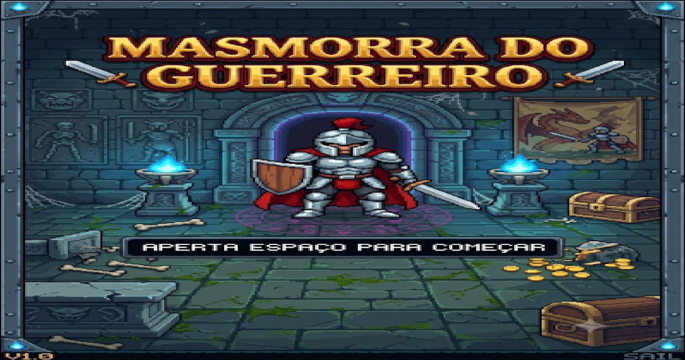
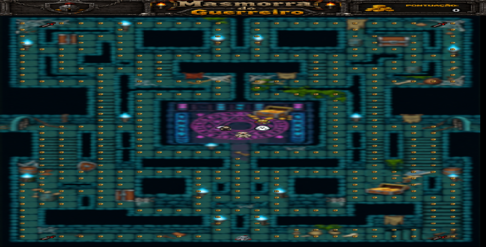

# Masmorra-do-Guerreiro
Masmorra do Guerreiro is a Pac-Man-style dungeon exploration game where the player must collect coins and survive, facing monsters while exploring the dungeon.
This project was developed as part of my studies in Computer Science and has been continuously improved with new mechanics and algorithms.

# Features
- Player movement
- Enemy IA
- Coin collection
- Score system
- Collision detection
- Sprite animation
- Dungeon map
- tunnel system

# Technologies
- C++
- SFML
- Object-Oriented Programming

# Screenshots

  
<b> Main Menu</b> (Click to expand)

  

     
    
  

  
<b> Map & Tunnels</b> (Click to expand)

  

     
    
    
  

  
<b> Monsters & Combat Power</b> (Click to expand)

  

     
    
    
  

  
<b> Score UI</b> (Click to expand)

  

     
    
    
  

# How to play

Compile using SFML

# What i Learned
- Object-Oriented Programming
- Game loop
- Collision detection
- Event handling
- Resource management
- Sprite rendering

# Future Improvements
- Better enemys IA
- New stages
- Improved sound effects
- Record-keeping system
